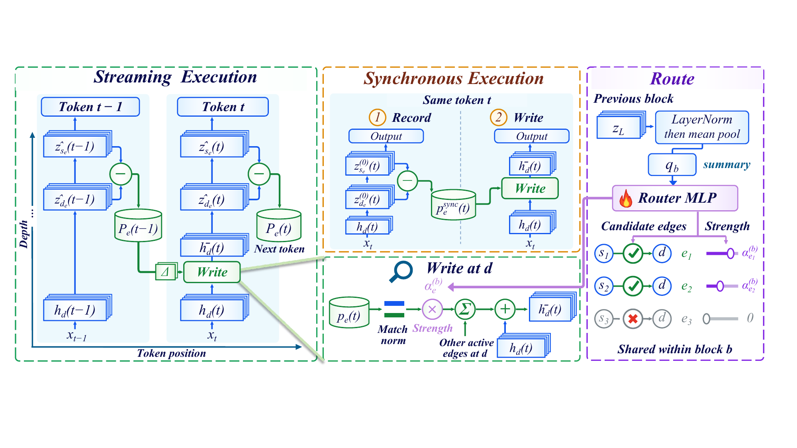
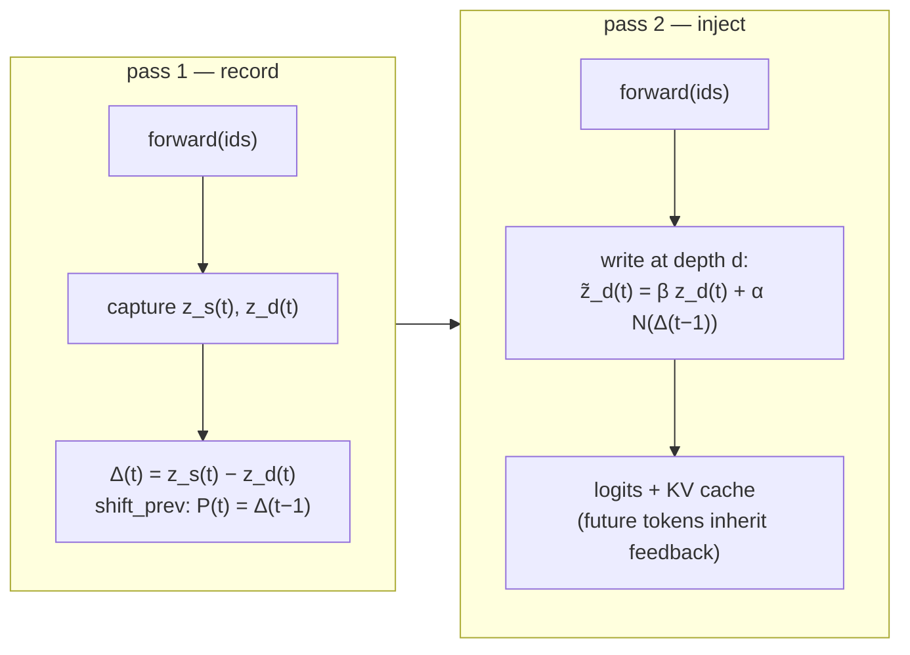

<div align="center">

# Write Back the Δ

### Learning to See the Same Tokens with New Eyes

[]()
[]()
[]()
[]()

**ReFlux** — inference-time depth-increment feedback for frozen Transformers.
Write what deep layers *newly computed* back into shallow layers, and let the
same tokens be seen with new eyes.



*Streaming execution (left), synchronous execution (middle), and the learned
routing of increment-carrying edges (right). All three operate on a frozen
backbone.*

</div>

---

## ✨ Highlights

- **Depth-increment payload.** We feed back the depth increment
  Δ = z_s − z_d — *exactly* the computation accumulated between two depths —
  rather than the full deep state. No redundant replay of what the target
  stream already contains.
- **Frozen backbone, no re-execution.** ReFlux writes feedback through hooks
  into the residual stream of a pretrained model. No weight updates, no
  layer looping, no second forward pass at decode time in streaming mode.
- **1× FLOPs streaming schedule.** The increment committed at position *t*
  is applied to position *t+1* within the standard autoregressive pass —
  measured runtime stays within **1.02–1.08×** of the base model.
- **Plug-and-play.** One (source, target) edge and one strength is enough to
  obtain consistent perplexity reductions across model families; the full
  method learns *which* edges to open per input.
---

## 🔧 Method

### The write operator

All schedules share one primitive --- an additive, norm-matched write into the target stream at depth $d$:

$$\tilde z_d = \mathrm{rescale}\!\left(\beta z_d + \alpha N_h(p)\right), \qquad N_h(p) = p \cdot \frac{\lVert z_d \rVert}{\lVert p \rVert + \varepsilon}.$$

where `p` is the feedback payload and `rescale` restores the pre-write norm
when `preserve_norm=True`. The two methods in this repository differ only in
what they put in `p`:

| schedule | payload `p` | β | norm restore | traversals | FLOPs |
|---|---|---|---|---|---|
| **Recirculation-v1** *(baseline reproduction)* | full state z_s | 1−α | ✗ | 2 (record → write) | 2× |
| **ReFlux-sync** *(ours)* | same-token increment Δ(t) = z_s(t) − z_d(t) | 0.9 | ✓ | 2 (record → inject) | 2× |
| **ReFlux-streaming** *(ours)* | lagged increment Δ(t−1) = z_s(t−1) − z_d(t−1) | 0.9 | ✓ | 2 (record → inject), then 1× at decode | **1×** |

### Streaming schedule



During autoregressive decoding only the **inject** path runs, one hook per
token — which is why streaming lands at the base model's runtime. The
synchronous schedule (`ReFluxSync`, `--method reflux-sync`) instead applies
the *same-token* increment and trades one extra traversal for higher fidelity
(≈2× FLOPs); it takes the same `--source/--target/--alpha/--beta` as
streaming, and its iterated variant is described in the paper.

## 📦 What's inside

```
reflux/            core library
├── write.py       feedback_write — the norm-matched additive write operator
├── hooks.py       Capture / Inject forward hooks, layer resolution, shift_prev
├── streaming.py   ReFluxStreaming — record→inject lagged-increment schedule
├── sync.py        ReFluxSync — record→inject same-token schedule (2× FLOPs)
├── recirculation_v1.py  RecirculationV1 — baseline reproduction
├── windows.py     fixed-length sliding-window corpus batching
├── metrics.py     per-window perplexity
└── models.py      bf16 model loading

scripts/
├── eval_ppl.py    CLI over {base, recirculation-v1, reflux-streaming}
├── prepare_corpus.py   plain-text corpus preparation
└── run_paper_configs.sh  run every config in configs/

configs/           per-model (source, target, strength) used in our evaluation
examples/          minimal API example
assets/            figures
```

## 🚀 Quickstart

```bash
pip install -r requirements.txt

# 1. prepare any plain-text corpus (e.g., C4 validation text)
python scripts/prepare_corpus.py --dataset allenai/c4 --subset en \
    --split validation --n_chars 3000000 --output data/corpus_c4.txt

# 2. evaluate the three arms on one model
python scripts/eval_ppl.py --model google/gemma-3-1b-pt --method base \
    --corpus data/corpus_c4.txt --windows 64

python scripts/eval_ppl.py --model google/gemma-3-1b-pt --method recirculation-v1 \
    --source 11 --target 4 --alpha 0.15 \
    --corpus data/corpus_c4.txt --windows 64

python scripts/eval_ppl.py --model google/gemma-3-1b-pt --method reflux-streaming \
    --source 11 --target 4 --alpha 0.20 --beta 0.9 \
    --corpus data/corpus_c4.txt --windows 64

# 3. or the synchronous schedule: same edge/strength, ~2x FLOPs, higher fidelity
python scripts/eval_ppl.py --model google/gemma-3-1b-pt --method reflux-sync \
    --source 11 --target 4 --alpha 0.20 --beta 0.9 \
    --corpus data/corpus_c4.txt --windows 64
```

Useful flags: `--window` (tokens per window), `--batch-size`, `--device`,
`--output` (JSON results), and `--bos auto` to prepend the tokenizer's BOS
token to every window (protocol-sensitive models only; see the paper's
discussion of windowing protocols).

Or run every paper configuration in one shot:

```bash
CORPUS=data/corpus_c4.txt WINDOWS=64 ./scripts/run_paper_configs.sh
```

### Python API

```python
from reflux import (ReFluxStreaming, ReFluxSync, RecirculationV1,
                    build_windows, load_model, window_ppl)

tok, model = load_model("google/gemma-3-1b-pt")
ids = build_windows(tok, open("data/corpus_c4.txt").read(), num_windows=8, window=1024)

method = ReFluxStreaming(model, source=11, target=4, alpha=0.2, beta=0.9,
                         preserve_norm=True)
ppl = window_ppl(model, ids, num_windows=8, forward_fn=method.forward)
method.remove()

# synchronous variant: writes the same-token increment, ~2x FLOPs
sync = ReFluxSync(model, source=11, target=4, alpha=0.2, beta=0.9)
ppl_sync = window_ppl(model, ids, num_windows=8, forward_fn=sync.forward)
sync.remove()
```


## License

MIT. See [LICENSE](LICENSE).
